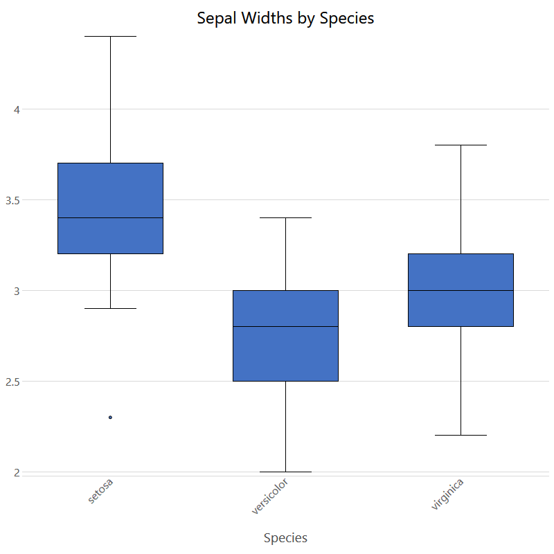

# Examples

## Summary

---

## Series Examples

### BoxPlotSeries

### CandleStickAndVolumeSeries

### CandleStickSeries

### ColumnSeries

### FunctionSeries

### HistogramSeries

### HistogramSeries2

### LineSeries

### PieSeries

### ScatterSeries

